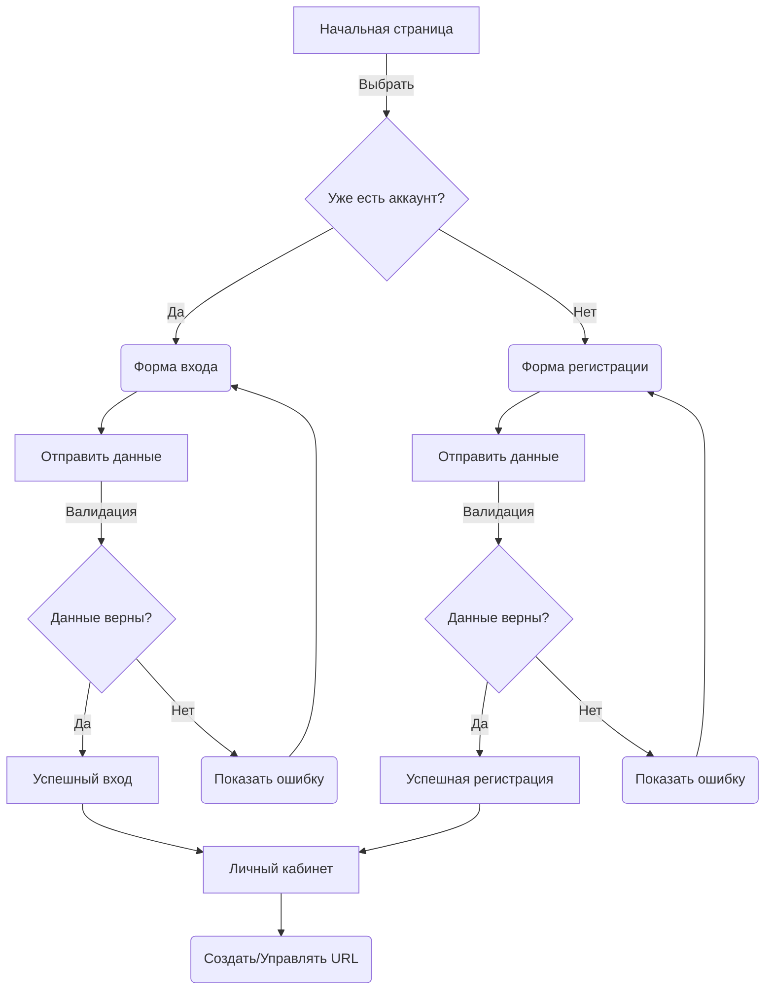
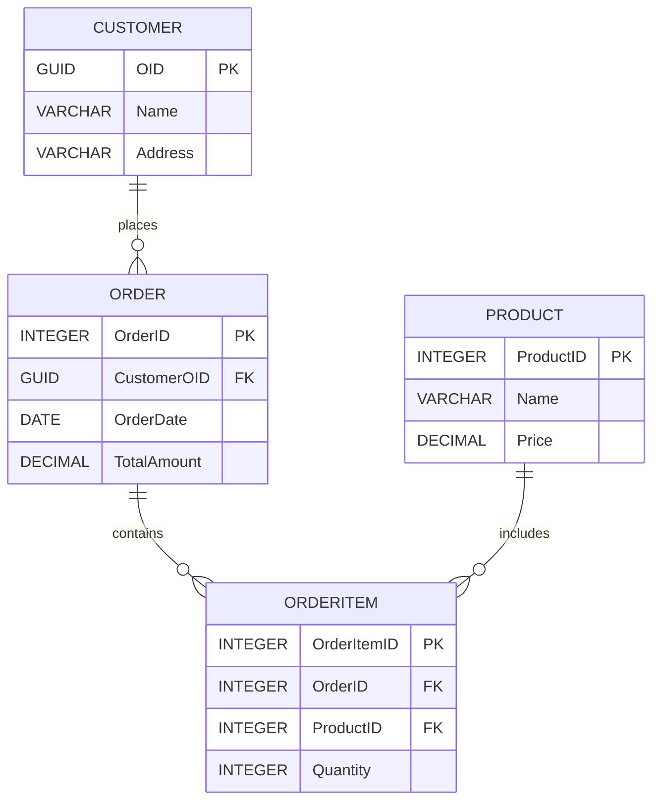
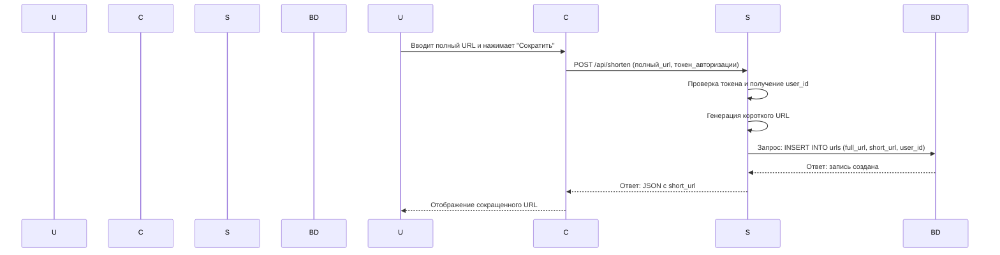

# URL Shortener

>Этот проект представляет собой сервис для сокращения URL-адресов, написанный на языке Go. Он предоставляет HTTP API для создания коротких URL и перенаправления по ним. В качестве хранилища используется PostgreSQL.



-----



------



## Запуск

#### **Git clone**

```shell
git clone https://github.com/golkity/Url_Shorter_Go.git
cd Url_Shorter_Go
```

#### Установка зависимостей

```shell
go mod tidy
```

#### Миграция

```shell
make migrat
```

#### Docker

запуск докер-образа

```shell
make dc-up
```

удаление докер-образа

```shell
make dc-down
```

